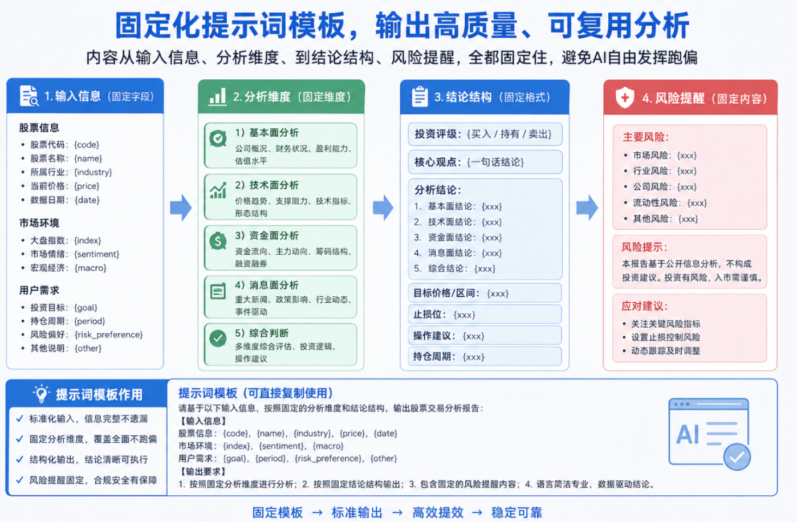

<div align="center">

# A股 AI 决策副驾

**散户交易全周期的 AI 提示词库 · 83 个高频纠结 · 11 个交易节点**

> 输入「股票名 + 代码 + 你的困惑」，AI 自动匹配对应框架，直接输出结构化分析。

[](./LICENSE)
[](https://github.com/CyAlcher/ai_native_a_stock_agent/stargazers)
[](https://github.com/CyAlcher/ai_native_a_stock_agent/network/members)
[](https://github.com/CyAlcher/ai_native_a_stock_agent/issues)
[](#各工具详细说明)

[English](#english-version) ·
[30 秒上手](#30-秒上手) ·
[真实样例](#真实样例能做出什么) ·
[11 个节点](#11-个交易节点--83-个问题) ·
[任意 AI 都能用](#方式三任意-ai-都能用-deepseek--kimi--豆包--chatgpt)



</div>

---

## 30 秒上手

```bash
# 1. 克隆
git clone https://github.com/CyAlcher/ai_native_a_stock_agent.git
cd ai_native_a_stock_agent

# 2. 一键装（自动识别本地 AI 工具）
bash install.sh
# 或指定工具：bash install.sh claude / codex / gemini / cursor / all

# 3. 在 AI 工具里直接提问（用人话就行）
# 统联精密 301168 今天回调了 8%，能建底仓吗？
```

---

## 它解决什么问题

**AI 用来炒股的最大痛点不是"不够聪明"，而是"不懂你在问什么"。**

同样一句「这个位置能买吗」，在**空仓踏空时**、在**小幅盈利时**、在**深度套牢时**，该给的回答完全不一样。

通用 AI 不知道你处于哪个节点，就只能给一套万能套话，听起来头头是道，用到交易上全是正确的废话。

这个工具做的事情很简单：**把散户的心理阶段先分类，再让 AI 按对应的框架回答。**

- 11 个交易节点：空仓观望、信息搜集、分析决策、买入建仓、持仓波动、盈利管理、亏损管理、触发止损止盈、离场执行、复盘总结、等待下一次机会
- 83 个高频问题：每个节点覆盖高 / 中 / 低频纠结，每个问题背后是一份**独立的结构化分析框架**
- 直接可用：Claude Code / Codex CLI / Gemini CLI / Cursor 任选一个，`bash install.sh` 就能装

---

## 三个核心卖点

<table>
  <tr>
    <td width="33%" valign="top">
      <h3>1. 按心理阶段分路由</h3>
      不是"万能 AI 聊股票"，而是识别你处在空仓 / 持仓 / 盈利 / 亏损 / 止损 / 复盘的哪一步，用对应的框架回答。避免散户最容易在冲动下做错的那一步。
    </td>
    <td width="33%" valign="top">
      <h3>2. 四家主流工具都支持</h3>
      一套框架，同时适配 <b>Claude Code / Codex CLI / Gemini CLI / Cursor</b>。装哪个用哪个，命令与产物完全一致。没装这些？复制 prompt 粘到 DeepSeek / Kimi / 豆包 / ChatGPT 也行。
    </td>
    <td width="33%" valign="top">
      <h3>3. 强制降速结构</h3>
      AI 写不了行情，但能帮你把"我要做什么"先想清楚。每条框架都带<b>前置条件检查 + 分档方案 + 风险提示</b>，把反射式操作挡在键盘之前。
    </td>
  </tr>
</table>

---

## 真实样例：能做出什么？

这不是空口白话。装好之后在 AI 工具里直接输入，会得到这样的结构化产出。

### `/gu/buy-q1 统联精密 301168 今天回调了 8%`

匹配到「买入建仓」节点的 q1 框架，AI 会输出四段：

**1. 回调性质判断（必须先完成此步）**
- 技术面：回调幅度、是否跌破关键均线、成交量是否萎缩
- 基本面：是否伴随批价下跌 / 业绩预警 / 政策利空
- 结论：趋势中继回调 / 高位震荡洗盘 / 趋势反转初期

**2. 建仓条件检查清单（全部满足方可建仓）**
- [ ] 回调幅度达到近期涨幅的 38.2%-61.8%（黄金分割区间）
- [ ] 成交量持续萎缩
- [ ] 股价未跌破 60 日均线
- [ ] 核心产品批价周环比跌幅 < 3%
- [ ] 沪深 300 未跌破 250 日均线

**3. 分档建仓方案（激进 / 稳健 / 保守）**
- 激进型：回调 5%-8%，建 30% 仓位，止损 -5%
- 稳健型：回调 8%-15%，建 50% 仓位，止损 60 日均线 -2%
- 保守型：回调 >15% 且估值至历史低位，建 70% 仓位，止损 -8%

**4. 风险提示**
- 继续跌破止损位必须无条件止损，不得以"长期持有"为由拒绝

**一句话结论**：当前回调是否满足建仓条件，建议建仓比例 ____%。

> 完整 83 份框架放在 [`.claude/commands/gu/`](./.claude/commands/gu/)，每份都是可 Read 可修改的 Markdown。

---

## 11 个交易节点 · 83 个问题

| # | 节点 | 命令前缀 | 问题数 | 典型问题 |
|---|------|---------|--------|---------|
| 01 | 空仓观望 | `/gu/watch-q*` | 7 | 现在能进场吗？感觉要踏空了 |
| 02 | 信息搜集 | `/gu/research-q*` | 9 | 帮我看看这只票，群里老师推荐的 |
| 03 | 分析决策 | `/gu/analyze-q*` | 8 | 这个位置还能买吗？是不是太高了 |
| 04 | 买入建仓 | `/gu/buy-q*` | 8 | 现在回调了，是不是可以建底仓了 |
| 05 | 持仓波动 | `/gu/hold-q*` | 8 | 跌了 3 个点了，要不要补仓摊低成本 |
| 06 | 盈利管理 | `/gu/profit-q*` | 8 | 赚了 5 个点了，要不要落袋为安 |
| 07 | 亏损管理 | `/gu/loss-q*` | 7 | 跌了 20% 了，还有必要割肉吗 |
| 08 | 触发止损止盈 | `/gu/trigger-q*` | 7 | 破了 20 日线了，是不是趋势走坏了 |
| 09 | 离场执行 | `/gu/exit-q*` | 7 | 刚卖完就涨停了，要不要追回来 |
| 10 | 复盘总结 | `/gu/review-q*` | 7 | 这次亏了这么多，下次我一定要拿住 |
| 11 | 等待下一次机会 | `/gu/wait-q*` | 7 | 休息了几天手又痒了，现在有什么票能买 |

> 完整索引见 [`.claude/commands/gu/index.md`](./.claude/commands/gu/index.md)。

---

## 使用方式

### 方式一：直接说人话（推荐）

装好后在工具里直接输入：

```
统联精密 301168 今天回调了 8%，能建底仓吗？
五粮液 000858 赚了 5 个点，要不要止盈？
贵州茅台 600519 破了 20 日线，要出来吗？
```

AI 会自动识别你处于哪个节点、匹配到哪个问题，用对应框架给你结构化分析。

### 方式二：精确命令

如果你已经知道要调用哪个框架：

```
/gu/buy-q1    统联精密 301168 今天回调了 8%
/gu/hold-q2   五粮液 000858 跌了 3 个点
/gu/profit-q1 贵州茅台 600519 赚了 5 个点
```

### 方式三：任意 AI 都能用（DeepSeek / Kimi / 豆包 / ChatGPT）

不需要安装，直接复制框架内容：

```bash
# 查看某个问题的框架
cat .claude/commands/gu/buy-q1.md

# 或用脚本生成可直接粘贴的版本
bash render.sh buy-q1 统联精密 301168 今天回调了8%
```

把输出粘到任意 AI 对话框即可。

---

## 各工具详细说明

### Claude Code

```bash
bash install.sh claude
```

安装后，在任意项目目录打开 Claude Code，直接输入问题或使用 `/gu/*` 命令。

### Codex CLI

```bash
bash install.sh codex
```

`AGENTS.md` 自动加载路由规则，在本项目目录运行 `codex` 即可。

### Gemini CLI

```bash
bash install.sh gemini
```

`GEMINI.md` 自动加载，在本项目目录运行 `gemini` 即可。

### Cursor

```bash
bash install.sh cursor
```

用 Cursor 打开本项目，Chat 面板直接提问。框架规则通过 `.cursor/rules/` 自动加载。

---

## 文件结构

```
.
├── install.sh                  # 一键安装脚本
├── render.sh                   # 生成可粘贴版本（任意 AI 用）
├── CLAUDE.md                   # Claude Code 路由规则
├── AGENTS.md                   # Codex CLI 路由规则
├── GEMINI.md                   # Gemini CLI 路由规则
├── .claude/commands/gu/        # 83 个分析框架文件（主数据源）
│   ├── index.md                # 全部命令索引
│   ├── buy-q1.md
│   ├── hold-q2.md
│   └── ...
├── prompt_template/            # 原始模板（含变量占位符）
├── question.csv                # 83 条问题原始数据
├── sanhu_expt_prompt.py        # 用 DeepSeek 批量生成提示词
└── build_data.py               # 生成 index.html 静态检索页
```

---

## 路线图

- [x] 83 个框架，11 个交易节点全覆盖
- [x] Claude Code / Codex / Gemini / Cursor 四家工具支持
- [x] `render.sh` 输出可粘贴版本，兼容任意 AI
- [ ] 盘后复盘自动模板，输入当日成交记录直接产出复盘
- [ ] `/gu/index` 变成交互式问答向导，用户不必记住节点名
- [ ] 社区贡献的「行业专用版」分支（半导体 / 医药 / 消费）

欢迎在 Issues 里投票最想看的下一个节点。

---

## 参与共建

- **提 Issue**：漏掉哪类散户纠结、框架跑偏、想加新节点都欢迎
- **提 PR**：改错别字、补一条示例命令、优化某份 prompt 都欢迎
- **贡献样例**：用这套框架跑过真实交易复盘，欢迎 PR 到示例目录

MIT 协议，代码自由使用。

---

## 关注作者

左边是**公众号**，更新项目动态与 AI × A 股的实战内容；
右边是**个人微信**，交流、反馈、提 bug、想增加新节点都欢迎。

<table>
  <tr>
    <td align="center">
      <br>
      <sub>微信公众号</sub>
    </td>
    <td align="center">
      <br>
      <sub>个人微信（交流 / 反馈）</sub>
    </td>
  </tr>
</table>

---

## English Version

**ai_native_a_stock_agent** is a structured prompt library for retail investors trading Chinese A-shares. It covers the **complete trading decision loop** — from watching the market with no position, all the way through entry, holding, profit-taking, stop-loss, and post-trade review.

### Why it exists

Generic AI gives generic answers. Ask "should I buy now?" when you're sitting on a 20% loss versus when you're fully in cash — the right answer is completely different. This tool solves that by **routing your question to the right framework based on your current trading stage**, not just the ticker.

### What's inside

- **11 trading stages**: watching / researching / analyzing / entering / holding / profit management / loss management / stop-loss triggers / exiting / reviewing / waiting for next opportunity
- **83 structured frameworks**: each one maps to a specific high-frequency dilemma retail investors face, with pre-conditions checklist, tiered action plans, and risk reminders
- **4 AI tools supported**: Claude Code, OpenAI Codex CLI, Gemini CLI, Cursor — one install command each
- **Any AI works**: no tool installed? `bash render.sh` outputs a paste-ready prompt for DeepSeek / Kimi / ChatGPT

### Quick start

```bash
git clone https://github.com/CyAlcher/ai_native_a_stock_agent.git
cd ai_native_a_stock_agent
bash install.sh          # auto-detects your installed AI tool
```

Then just type in plain language:

```
贵州茅台 600519 — up 5%, should I take profit?
统联精密 301168 — down 8% today, time to build a position?
五粮液 000858 — broke the 20-day MA, should I exit?
```

The agent routes to the matching framework and returns a structured analysis with checklist, sizing tiers, and a one-line verdict.

### Recommended GitHub Topics

`a-share` `chinese-stock-market` `ai-agent` `claude-code` `codex-cli` `gemini-cli` `cursor` `prompt-library` `trading-psychology` `decision-framework` `deepseek` `retail-investor`

---

## 免责声明

本工具仅为决策辅助，所有输出内容由 AI 生成，**不构成任何投资建议**。
投资有风险，入市需谨慎。任何决策请基于自己的独立判断与风险承受能力。
